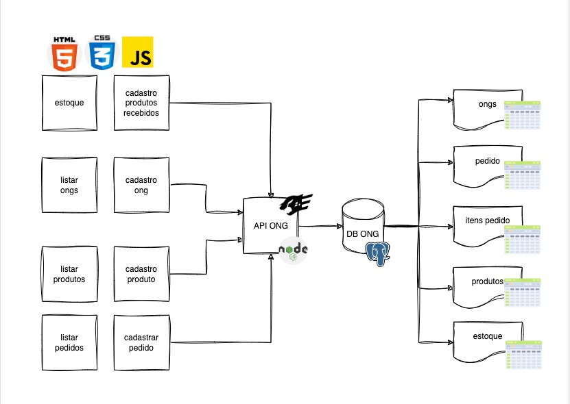

# ONG Management System
Sistema de gestão de doações e distribuição de alimentos para ONGs.

## Problema
Você recebeu o contato de uma ONG (Organização não Governamental) que trabalha com distribuição de alimentos para outras ONGs, de acordo com o que pedem. A ONG recebe as doações em pacotes, com diversos alimentos dentro, armazena e depois entrega essas doações em outros pacotes.
A Organização não Governamental na qual você tem o contato pode receber um pacote com 200 kg de arroz, 100kg de feijão e 300 latas de óleo, e recebe um pedido de outra ONG pedindo a doação de 30kg de arroz, 10kg de feijão e 15 latas de óleo. Para isso, a entrega deve ser feita com outros pacotes, visto que será necessária uma separação diferente.

### Objetivo
Criar uma API RESTful e Frontend para:
- gestão de produtos
- controle de produtos doados
- gestão de ongs
- registro de pedido
- controle de estoque

### Proposta
- Registre o recebimento dos pacotes, assim como também cadastre separadamente os produtos recebidos de acordo com o peso ou unidades;
- Registre os pedidos de doação, com as quantidades de produtos solicitadas;
- Valide se é possível atender aos pedidos;
- Emite uma listagem completa dos pedidos efetuados;
- Emite uma listagem do estado atual do estoque de alimentos;
- Efetue a entrega de um pedido, fazendo a baixa das quantidades no estoque e registrando a entrega.

### Arquitetura

